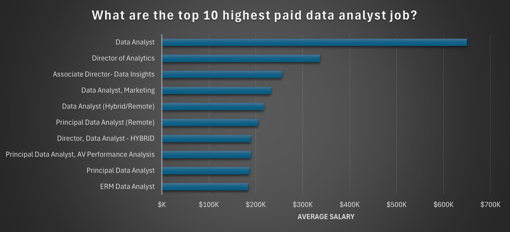
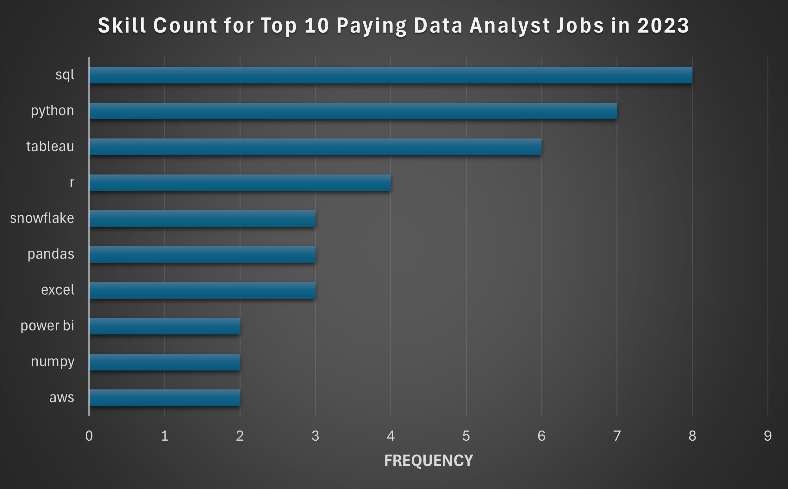

# Introduction
I had dive into the data job market! Focusing on data analyst roles, this project explores top-paying jobs, in-demand skills, and where high demand meets high salary in data analytics. 
🔍 SQL queries? Check them out here: [project_sql folder](/project_sql/)

# Background
This project was started because I wanted to better understand the data analyst job market. The goal is to find out which skills are the most needed and highest paid, and to make it easier for others to find the best jobs.

Data comes from my [SQL Course](https://www.lukebarousse.com/sql). It is  packed with insights on job titles, salaries, locations and essential skills.

### The questions I wanted to answer through my SQL queries were:

1. What are the top-paying data analyst jobs?
2. What skills are required for these top-paying jobs?
3. What skills are most in demand for data analyst?
4. Which skills are associated with higher salaries?
5. What are the most optimal skills to learn?

# Tools I Used
For my deep dive into the data analyst job market, I utilized the capability of several key tools: 

- **SQL:** The backbone of my analysis, allowing me to query the database and discover critical insights.
- **PostgreSQL:** The chosen database management system, ideal for handling the job posting data.
- **Visual Studio Code:** My go-to for database management and executing SQL queries.
- **Git & Github:** Essential for version control and sharing my SQL scripts, ensuring project tracking.

# The Analysis
Each query for this project aimed at investigating specific aspects of the data analyst job market. Here is how I approach each question:

### 1. Top Paying Data Analyst Jobs
To identify the highest-paying roles, I filtered data analyst positions by average yearly salary and location, focusing on remote jobs only. This query highlights the high paying opportunities in the field.

```SQL
SELECT
    job_id,
    job_title,
    job_location,
    job_schedule_type,
    salary_year_avg,
    job_posted_date,
    name AS company_name
FROM
    job_postings_fact
LEFT JOIN company_dim ON job_postings_fact.company_id = company_dim.company_id
WHERE
    job_title_short = 'Data Analyst' AND
    job_location = 'Anywhere' AND
    salary_year_avg IS NOT NULL
ORDER BY
    salary_year_avg DESC
LIMIT 10;
```
### General Observations
- Leadership roles (like Director or Associate Director) usually pay more due to responsibilities in managing data teams and shaping company strategies.
- Tech companies (Meta, Pinterest) tend to offer higher salaries for data positions.
- Specialized roles (like in marketing or healthcare) can also offer high salaries if the industry values data insights highly.
- Remote or hybrid roles do not always mean lower pay, some are still top-tier!

  
*Bar chart showing the top 10 highest-paying roles for data analysts.*

### 2. Skills for Top Paying Jobs
To understand what skills are required for the top-paying jobs, I combined the job postings with the skills data providing insights into what employers value for high-compensation roles.

```sql
WITH top_paying_jobs AS (
    SELECT
        job_id,
        job_title,
        salary_year_avg,
        name AS company_name
    FROM
        job_postings_fact
    LEFT JOIN company_dim ON job_postings_fact.company_id = company_dim.company_id
    WHERE
        job_title_short = 'Data Analyst' AND
        job_location = 'Anywhere' AND
        salary_year_avg IS NOT NULL
    ORDER BY
        salary_year_avg DESC
    LIMIT 10
)

SELECT 
    top_paying_jobs.*,
    skills_dim.skills
FROM top_paying_jobs
INNER JOIN skills_job_dim ON top_paying_jobs.job_id = skills_job_dim.job_id
INNER JOIN skills_dim ON skills_job_dim.skill_id = skills_dim.skill_id
```
### Most In-Demand Skills from the analysis:

- **SQL** is leading with a high count of 8.
- **Python** follows closely with a count of 7.
- **Tableau** comes next with a count of 6.
- Other skills like **R**, **Snowflake**, **Pandas** and **Excel** show varying degrees of demand.

  
*Bar chart showing the number of skills required for the top 10 highest-paying data analyst roles.*

### 3. In-Demand Skills for Data Analyst
This query helped identify the skills most frequently requested in job postings, directing focus to areas with high demand.

```sql
SELECT 
    skills,
    COUNT(skills_job_dim.job_id) AS demand_count
FROM job_postings_fact
INNER JOIN skills_job_dim ON job_postings_fact.job_id = skills_job_dim.job_id
INNER JOIN skills_dim ON skills_job_dim.skill_id = skills_dim.skill_id
WHERE
    job_title_short = 'Data Analyst' AND
    job_work_from_home = TRUE
GROUP BY
    skills
ORDER BY
    demand_count DESC
LIMIT 5;
```
### Most Demanded Skills for data analysts in 2023
- SQL and Excel remain fundamental, emphasizing the need for strong foundational skills in data processing and spreadsheet manipulation.
- Programming and Visualization Tools like Python, Tableau and Power BI are essential, pointing towards the increasing importance of technical skills in data storytelling and decision support.

|   Skills   | Demand Count |
|------------|--------------|
| SQL        |     7291     |
| Excel      |     4611     |
| Python     |     4330     |
| Tableau    |     3745     |
| Power BI   |     2609     |

*Table of the demand for the top 5 skills in data analyst job postings*

### 4. Skills Based on Salary
Exploring the average salaries associated with different skills revealed which skills are the highest paying.

### Top paying skills for Data Analysts:
Specialized & Emerging Tech Leads to Higher Salaries.
- Niche technologies like **SVN**, **Solidity**, and **Couchbase** offer premium pay due to limited expertise and high business impact, particularly in blockchain and database management.

AI & Machine Learning Continue to Dominate.
- The presence of **MXNet**, **Keras**, **PyTorch**, and **Hugging Face** highlights how AI and deep learning skills remain essential for industries investing in automation, predictive analytics, and NLP.

Cloud & DevOps Are Driving Modern Infrastructure
- Skills like **Terraform**, **VMware**, and **Ansible** show that cloud computing, automation, and scalable infrastructure are crucial for businesses, making these skills highly rewarding.

| Rank | Skill       |  Average Salary (USD) |
|------|-------------|-----------------------|
| 1    | SVN         | $400,000              |
| 2    | Solidity    | $179,000              |
| 3    | Couchbase   | $160,515              |
| 4    | DataRobot   | $155,486              |
| 5    | Golang      | $155,000              |
| 6    | MXNet       | $149,000              |
| 7    | dplyr       | $147,633              |
| 8    | VMware      | $147,500              |
| 9    | Terraform   | $146,734              |
| 10   | Twilio      | $138,500              |

*These are the top-paying technical skills based on average salary. Learning or mastering these tools and technologies can help boost your chances of landing a high-paying data analyst job*

### 5. Most Optimal Skills to Learn
Combining insights from demand and salary data, this query aimed to pinpoint skills that are both in high demand and high salaries, offering a strategic focus for skill development.

```sql
SELECT
    skills_dim.skill_id,
    skills_dim.skills,
    COUNT(skills_job_dim.job_id) AS demand_count,
    ROUND(AVG(job_postings_fact.salary_year_avg), 0) AS avg_salary
FROM job_postings_fact
INNER JOIN skills_job_dim ON job_postings_fact.job_id = skills_job_dim.job_id
INNER JOIN skills_dim ON skills_job_dim.skill_id = skills_dim.skill_id
WHERE
    job_title_short = 'Data Analyst'
    AND salary_year_avg IS NOT NULL
    AND job_work_from_home = True
GROUP BY
    skills_dim.skill_id
HAVING
    COUNT(skills_job_dim.job_id) > 10
ORDER BY
    avg_salary DESC,
    demand_count DESC
LIMIT 25;
```

| Rank | Skill    |  Demand Count |  Average Salary (USD) |
|------|----------|---------------|-----------------------|
| 1    | Python   | 236           | $101,397              |
| 2    | Tableau  | 230           | $99,288               |
| 3    | R        | 148           | $100,499              |
| 4    | SAS      | 63            | $98,902               |
| 5    | Looker   | 49            | $103,795              |
| 6    | Snowflake| 37            | $112,948              |
| 7    | Oracle   | 37            | $104,534              |
| 8    |SQL Server| 35            | $97,786               |
| 9    | Azure    | 34            | $111,225              |
| 10   | AWS      | 32            | $108,317              |

*These skills appear most frequently in job listings for data analysts. If you're aiming to boost your chances of getting hired, focusing on these tools and platforms is a great strategy.*

#### Most optimal skills for Data Analysts in 2023:
- **Python** and **Tableau** are the most in-demand tools for data analyst roles, showing their importance in the industry.
- Cloud and database skills like **Snowflake**, **Azure**, and **AWS** are also highly valued and often offer higher salaries.
- Traditional tools like **R**, **SAS**, and **SQL** still have strong demand, especially in large companies and government sectors.

# What I Learned
Throughout this adventure, I have enhance my SQL toolkit with some equipments:

- Complex Query Crafting: I have mastered advanced SQL, starting from the basics and progressing to a strong understanding of complex queries.
- Data Aggregation:  I can use GROUP BY along with aggregate functions like COUNT() and AVG() to help summarize my data effectively.
- Analytical Skill: Leveled up my real-world puzzle-solving skills, turning questions into actionable, insightful SQL queries.

# Conclusion

### Insights

**Top-Paying Data Analyst Jobs**: The highest-paying jobs for data analysts that allow remote work offer a wide range of salaries, the highest at $650,000!

**Skills for Top-Paying Jobs**: High-paying data analyst jobs require advanced proficiency in SQL, suggesting it's a critical skill for earning a top salary.

**Most In-Demand Skills**: SQL is also the most demanded skill in the data analyst job market, thus making it essential for job seekers.

**Skills with Higher Salaries**: Specialized skills, such as SVN and Solidity, are associated with the highest average salaries, indicating a premium on niche expertise.

**Optimal Skills for Job Market Value**: SQL leads in demand and offers for a high average salary, positioning it as one of the most optimal skills for data analysts to learn to maximize their market value.

### Closing Thoughts
This project enhanced SQL skills and provided valuable insights into the data analyst job market. The findings from the analysis serve as a guide to prioritizing skill development and job search efforts. Aspiring data analysts can better position themselves in a competitive job market by focusing on high-demand, high-salary skills. This exploration highlights the importance of continuous learning and adaptation to emerging trends in the field of data analytics.
